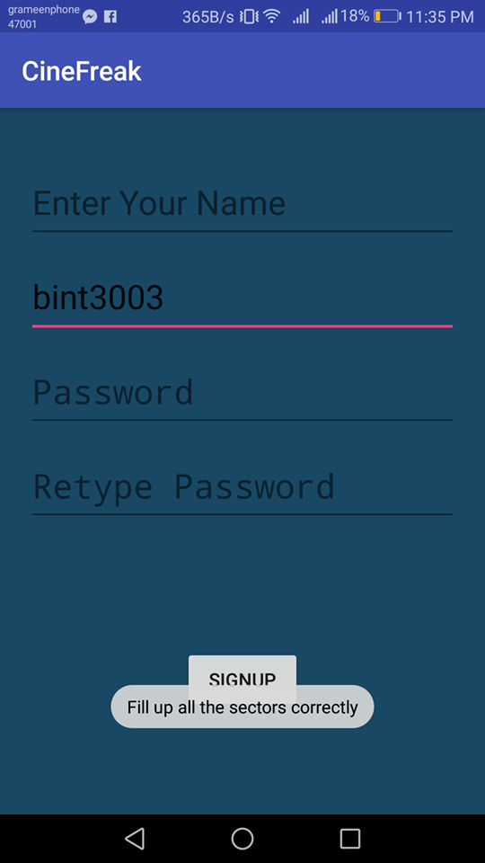
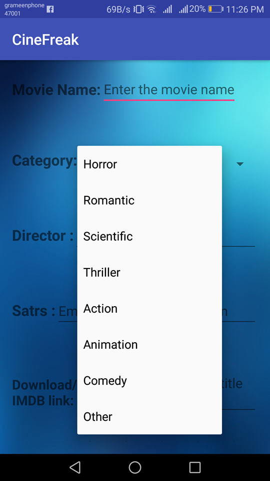
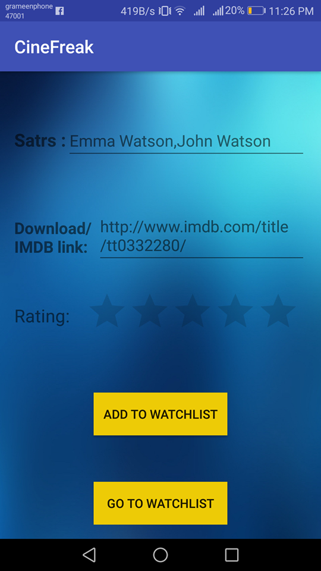
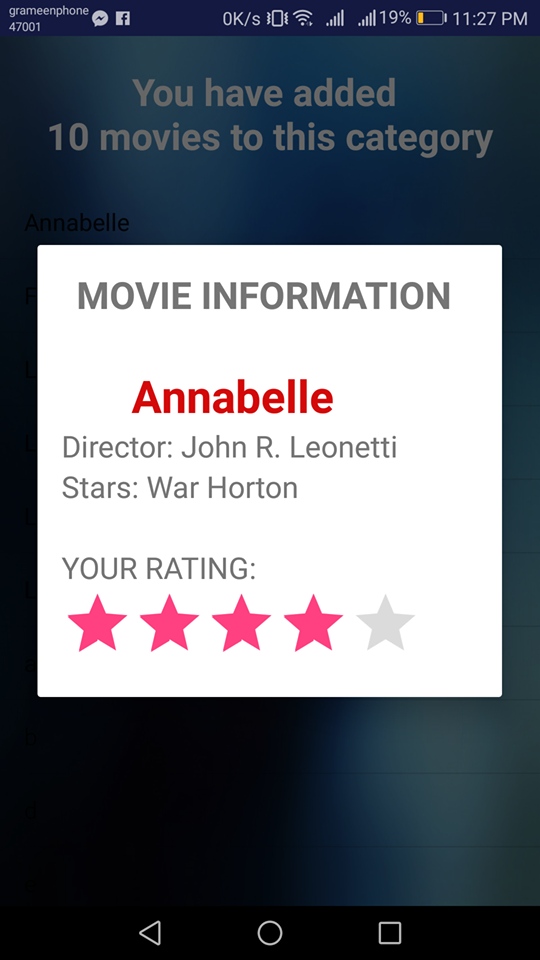

# CineFreak-Android-App

<h3>Tools</h3>
<li> Android Studio </li>

 

  

    
  

  

    
  

  

    
  

   

    
  

   

    
  

   

    
  

   

    
  

   

    
  

   

    
  

   

    
  

<h3> Features </h3>
 <ul>
			  <li> Personal Account.</link>
			  <li> Usual Sign in & Sign up errors such as - fields are filled properly, user name already taken, wrong or mistmatched password etc.</li>
			  <li>Storing Movie Information such as actor, actress, director name, your own rating,download link etc.</li>
			  <li>Listing wishlist and watchlist categorywise.</li>
			  <li>Number of Movies have been added to movie lists in particulat category.</li>
			  <li>Long Press on the movie name delete the movie's information.</li>
			  <li>One press on the movie name shows the information.</li>
			  <li>IMDB Link.</li>
			  
</ul>
